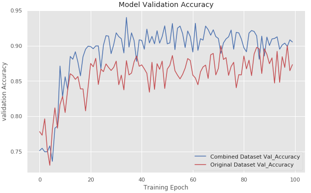

# Bidir-LSTM-HAR-Generation
Human Activity Generation and Recognition using Bidirectional LSTMs
This was my final year B.E. project wherein the dataset was from Wireless Sensor Data Mining Lab (WISDM). The objective of the project was to improve the classification accuracy of the dataset by introducing new generated data with the help of bidirectional Long-Short Term Memory(LSTM) networks. This model was first trained on the original dataset and was then used to predict the values of 6 different activities. These generated activities were compared with the original dataset activities and their losses were compared. For classification purpose, a convolution 1D activity classifier was built. This activity classifier was then trained on both the original dataset and the extended dataset, having generated activities. The results showed that the accuracy improved by expanding the dataset.
## Dataset
The data used for classification is provided by the Wireless Sensor Data Mining (WISDM) Lab and can be downloaded from (www.cis.fordham.edu/wisdm/dataset.php). It consists of 1,098,207 examples of various physical activities (sampled at 20Hz) with 6 attributes: user,activity,timestamp,x-acceleration,y-acceleration,z-acceleration, and the activities include: Walking, Jogging, Upstairs, Downstairs, Sitting, Standing.
## Code
The code is available in Juypter notebooks divided into 2 parts.

### The Data Sequence Generation by Bidirectional LSTM
https://github.com/Vivek-23-Titan/Bidir-LSTM-HAR-Generation/blob/master/Comparison_of_Activity_Classifier_Performance.ipynb

### The 1-D Convolutional Activity Performance comparsion
https://github.com/Vivek-23-Titan/Bidir-LSTM-HAR-Generation/blob/master/Comparison_of_Activity_Classifier_Performance.ipynb

## Results
The results of the comparison between the validation dataset of the both datasets is shown below.

The comparison between the original dataset and the combined dataset is shown with the help of confusion matrix.

### Original Dataset Confusion Matrix (~89%)

### Combined Dataset Confusion Matrix (94.1%)

The maximum accuracy attained by the combined training dataset was 94.1% which is an improvement of 4% over the original dataset.

### Requirements

TensorFlow version 2.2.0\
Keras version 2.3.1
